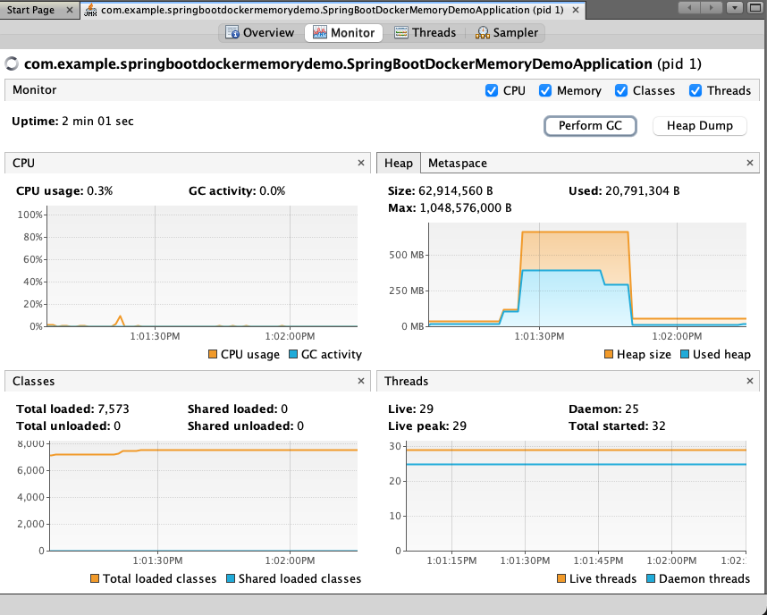

# Spring Boot Docker Demo

## Medium Article

To accompany this project, a detailed Medium article has been created. The article covers various aspects of Dockerizing a Spring Boot application and offers a step-by-step guide. You can find the article at the following link:

[Briding the memory gap between your device and the cloud](https://medium.com/@wout.raymaekers/740781900fbf)

Allows you to quickly play around with memory consumption 



## Usage

### Build and compile the application
```
mvn clean install
```

### Run the spring boot application

```
mvn spring-boot:run
```

### Build the docker image
```
mvn compile jib:dockerBuild
```

### Launch docker compose
```
docker-compose up -d
```

### Take up memory

We have provided an endpoint allowing you to easily force the app to consume an amount of memory (in megabytes) and retain it.
This allows for easy testing memory consumption.
Everytime you reserve some memory you will get an ID for that block of memory that you can later use to release using the `releaseMemory` endpoint

```
curl  http://localhost:8080/memory/take/100

Allocated 100 megabytes of memory with ID 4 
```

### Releasing memory

Release the memory by using the ID returned by the `takeMemory` endpoint

```
curl  http://localhost:8080/memory/release/4

Released memory with ID 4
```


### Using Visual VM

When you are running yout application on a remote server, even with the following `JAVA_TOOL_OPTIONS` exposed, you might still run into difficulties connecting to it via VisualVM

```
export JAVA_TOOL_OPTIONS="-Dcom.sun.management.jmxremote.port=9010 -Dcom.sun.management.jmxremote.ssl=false -Dcom.sun.management.jmxremote.authenticate=false -Dcom.sun.management.jmxremote.rmi.port=9010 -Dcom.sun.management.jmxremote.host=0.0.0.0 -Djava.rmi.server.hostname=0.0.0.0"
```

In that case you need to setup a tunnel (replace 1.2.3.4 with your public ip address)

```
ssh -i ~/.ssh/ec2-test-keypair.pem ec2-user@1.2.3.4 -N -L 0.0.0.0:9010:127.0.0.1:9010
```

That way you will be able to hook up VisualVM to it using 127.0.0.1:9010